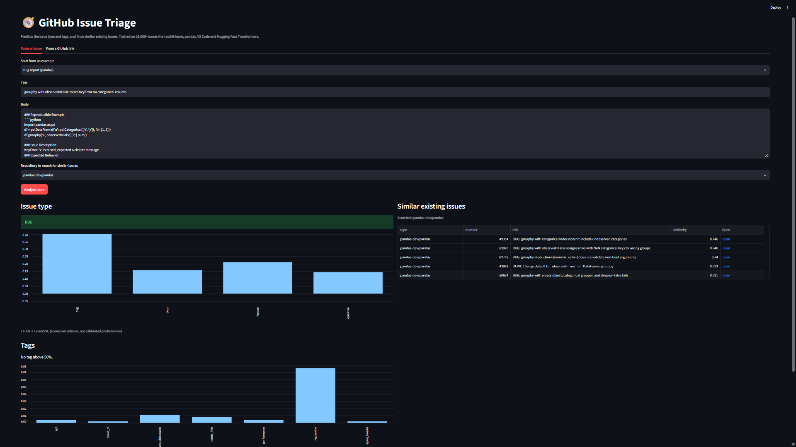
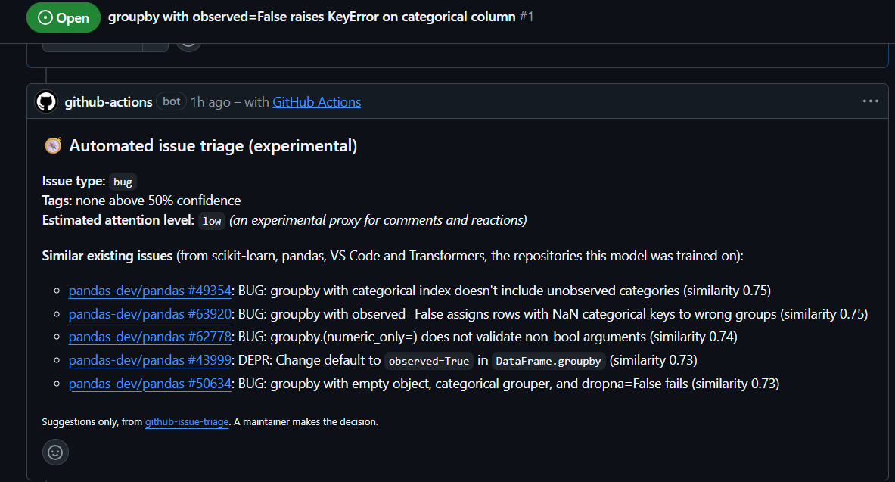

# GitHub Issue Triage

An NLP system that reads a GitHub issue and predicts its **type** (bug / feature / docs / question), suggests **tags** (performance, regression, needs_info and more) and finds **similar existing issues**. It was trained on 29,201 real issues from scikit-learn, pandas, VS Code and Hugging Face Transformers.

**[Try the live demo](https://app-issue-triage-hptj62dn5bryucgri55ufy.streamlit.app/)** (free hosting, so the first load can take a minute or two)



## What it does

| Output | Model |
|---|---|
| Issue type | TF-IDF + LinearSVC |
| Tags (multi-label) | Fine-tuned DistilBERT |
| Similar issues | Sentence-BERT embeddings + FAISS search |

It also runs as a **GitHub Action**: when someone opens an issue in this repository, the bot comments with the same predictions and adds a label.



## How I built it

1. **Collected** 32,000 issues (8,000 per repository) with the GitHub Search API, using date windows to get past the API's 100-page limit.
2. **Cleaned and labelled** them: removed bots and team-internal items (29,201 real issues remain), mapped maintainers' labels to 4 types and 7 tags with exact matching, and split each repository by time (oldest 70% train, next 15% validation, newest 15% test).
3. **Trained** TF-IDF baselines first, then fine-tuned DistilBERT on a free Colab GPU, and kept the better model for each task.
4. **Built duplicate ground truth** from issues that maintainers closed as duplicates (857 found, 699 with a known original), then measured how often the search finds the original.
5. **Deployed** the models on the Hugging Face Hub, a Streamlit app and the GitHub Action bot.

## Results

All scores are on the test set: the newest issues of each repository, which the models never saw.

**Issue type** (4 classes)

| Model | Test macro-F1 | Accuracy | `question` F1 |
|---|---|---|---|
| TF-IDF + Logistic Regression | 0.797 | | 0.581 |
| **TF-IDF + LinearSVC** (used) | **0.820** | 0.96 | 0.628 |
| DistilBERT (5 epochs) | 0.794 | | 0.421 |

**Tags** (7 labels, multi-label)

| Model | Test micro-F1 | Test macro-F1 |
|---|---|---|
| TF-IDF + Logistic Regression | 0.400 | 0.430 |
| **DistilBERT** (used) | **0.439** | **0.471** |

**Duplicate search** (636 duplicates, original searched among earlier issues of the same repository)

| Method | recall@1 | recall@5 | recall@10 | MRR |
|---|---|---|---|---|
| TF-IDF | 0.138 | 0.215 | 0.263 | 0.182 |
| **Sentence-BERT** (used) | **0.239** | **0.436** | **0.531** | **0.338** |

What the numbers say:
- For issue type, a simple TF-IDF model beat the fine-tuned DistilBERT. They are equal on bug, docs and feature; the gap comes mostly from the rare `question` class (only 10 test examples), so I used the simpler model.
- DistilBERT is better for tags (5 of 7 tags), so each task uses the model that scored better.
- Sentence-BERT roughly doubles TF-IDF for duplicate search. The original appears in the top 10 suggestions for 53% of duplicates.

Full tables, per-class scores and error analysis: [docs/RESULTS.md](docs/RESULTS.md), [docs/ERROR_ANALYSIS.md](docs/ERROR_ANALYSIS.md). Data and label details: [docs/METHODOLOGY.md](docs/METHODOLOGY.md).

## Limitations

- Labels come from maintainers and are noisy, so the scores partly measure how consistently they labelled.
- `question` is rare and weak, and tag prediction is hard (best micro-F1 0.44).
- Only four Python and developer-tool repositories were used, and 77% of the duplicate test pairs are from VS Code. It is not tested on other projects.

## Run it

```bash
git clone https://github.com/riya28daxini/github-issue-triage.git
cd github-issue-triage
pip install -r deploy/streamlit_cloud/requirements.txt
streamlit run deploy/streamlit_cloud/app.py
```

The models download from the Hugging Face Hub (`Riyaaa28/issue-triage-artifacts`) the first time.

To rebuild the data and baselines (needs a `GITHUB_TOKEN`):

```bash
pip install -r requirements.txt
python src/collect_issues.py --max-per-repo 8000 --out-dir data/raw
# run notebooks/02_labels.ipynb, then:
python src/preprocess.py
python src/train_baseline.py --task type --model svm
```

DistilBERT and the duplicate search are trained in the notebooks in `colab/` on a free Colab GPU.

## Project layout

```
src/         data collection, label mapping, text cleaning, TF-IDF baselines, duplicate pairs
notebooks/   EDA, labels, text cleaning, error analysis
colab/       DistilBERT training, duplicate search, upload to the Hugging Face Hub
deploy/      Streamlit app (live demo) and a FastAPI + Docker version
bot/         GitHub Action bot
docs/        results, methodology, error analysis, screenshots
```

**Built with:** Python, pandas, scikit-learn, PyTorch, Hugging Face Transformers, Sentence-Transformers, FAISS, MLflow, Streamlit, FastAPI, GitHub Actions.

**Riya**, B.Tech Computer Engineering, Nirma University | [LinkedIn](https://www.linkedin.com/in/riya-daxini-623627377) | [GitHub](https://github.com/riya28daxini)
